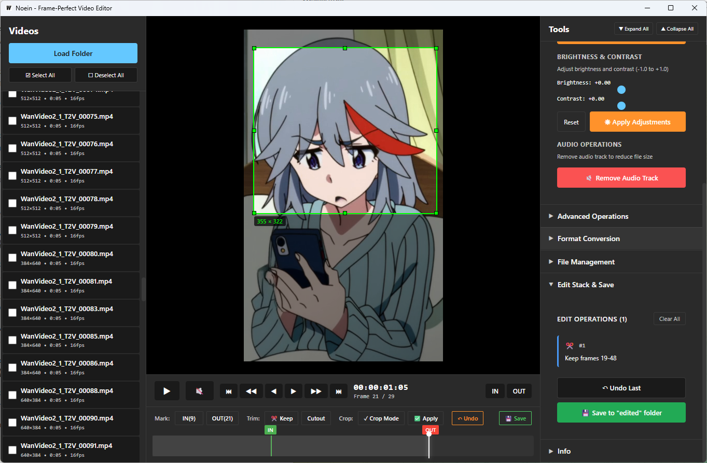

# Noein

Frame-perfect video editor for Windows. Built for dataset preparation and precise video editing.

## Features

- **Frame-accurate navigation** with keyboard shortcuts (±1, ±10 frame jumps)
- **Batch processing** with Select All/Deselect All and batch save checkbox
- **Visual crop selection** - draw regions directly on video
- **Auto-resume** - loads last folder and video on startup
- **File management** - delete or move videos to folders
- **Edit operations**: Trim, Crop, Scale, Rotate/Flip, Grayscale, FPS conversion, Frame skip, Brightness/Contrast, Audio removal, Speed adjustment, Padding, Format conversion (MP4/AVI/MKV/MOV/WebM)
- **Non-destructive editing** - operations work on temp files, originals preserved
- **Undo support** and edit stack management

## Screenshot



## Requirements

- Windows 10/11
- FFmpeg (auto-downloaded by launcher or place in PATH)
- For building: Go 1.21+, Node.js 18+

## Quick Start

**Easy way:** Run `launcher.bat` - auto-builds project, downloads FFmpeg if needed, and launches app.

**Manual build:**
```bash
go install github.com/wailsapp/wails/v2/cmd/wails@latest
wails build
```
Executable: `build/bin/noein.exe`

## Usage

1. Load folder → Auto-resumes last session
2. Select videos (Select All/Deselect All or individual checkboxes)
3. Set IN/OUT points (I/O keys or quick panel)
4. Apply operations: Keep/Cutout segments, crop, or use tool panels
5. Preview and undo if needed
6. Save: Single (💾 Save) or Batch (check "Apply to all X selected" + Save)

## Operations

**Trim:** Keep/Remove IN-OUT segments | **Crop:** Draw selection on video | **Transform:** Scale (presets or custom), Rotate (90/180/270°), Flip | **Frame:** Skip every Nth, Grayscale | **Quality:** FPS conversion (arbitrary values), Brightness/Contrast, Remove audio | **Advanced:** Speed (0.5-2x), Padding, Trim duration | **Format:** Convert to MP4/AVI/MKV/MOV/WebM with H.264/H.265/VP9 | **File:** Move to folder or delete

## Keyboard Shortcuts

| Key | Action |
|-----|--------|
| `Space` | Play/Pause |
| `←` | Previous Frame |
| `→` | Next Frame |
| `Shift + ←` | Jump Back 10 Frames |
| `Shift + →` | Jump Forward 10 Frames |
| `Home` | Jump to Start |
| `End` | Jump to End |
| `I` | Set In Point |
| `O` | Set Out Point |
| `M` | Toggle Mute |

## Technical

**Stack:** Go + Wails v2, Svelte 4 + Vite, FFmpeg | **Cutting:** Frame-perfect with libx264 CRF 18 (visually lossless) | **Performance:** Parallel frame extraction, LRU cache (100 frames) | **Formats:** MP4, MOV, AVI, MKV, WebM

## Project Structure

```
noein/
├── app/                    # Go backend
│   ├── app.go             # Main application logic
│   ├── models/            # Data models
│   ├── video/             # Video management
│   └── ffmpeg/            # FFmpeg wrapper
├── frontend/              # Svelte frontend
│   └── src/
│       ├── components/    # UI components
│       └── stores/        # State management
├── build/                 # Build output
└── wails.json            # Wails configuration
```

## Troubleshooting

**FFmpeg not found:** Place `ffmpeg.exe` and `ffprobe.exe` in app directory or system PATH
**Video not loading:** Convert to MP4/H.264 format

## Development

```bash
wails dev  # Hot-reload mode
```

**Structure:** Backend (`app/`), Frontend (`frontend/src/`), Models (`app/models/`), FFmpeg wrapper (`app/ffmpeg/`)

## License

MIT License
